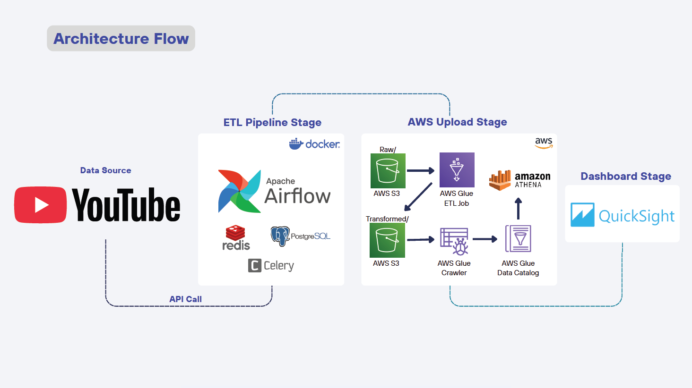
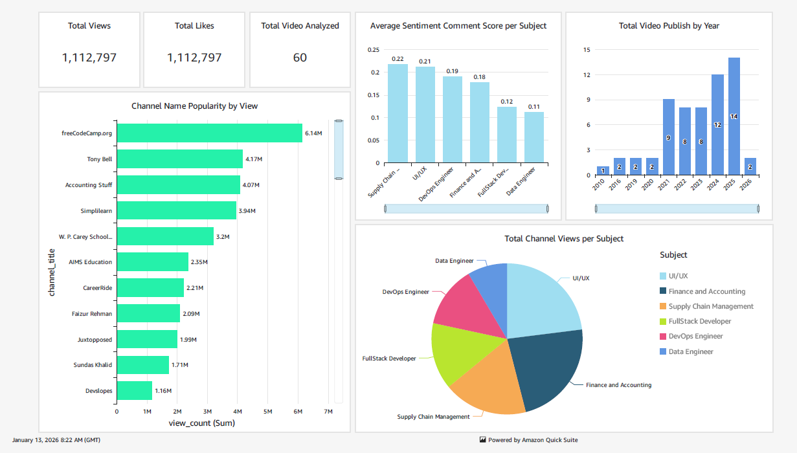

# Final Project Data Engineering Bootcamp
# Youtube Trending Video Analytics & Sentiment Pipeline

## 📌 Project Overview
This project aims to build an end-to-end data engineering pipeline that processes and analyzes YouTube Trending Videos along with audience sentiment across various professional subjects such as Data Engineering, DevOps, Finance & Accounting, UI/UX, and more.

The pipeline performs daily batch ingestion using the YouTube Data API for each subject query. The collected data includes video metadata and top video comments, followed by sentiment analysis by calculating the average sentiment score from the comments.

The final processed data is stored in Parquet format and visualized using AWS QuickSight dashboards to support engagement and sentiment analysis.

## 📌 Flow Pipeline:
Youtube Data API -> Python ETL -> Airflow Orchestration -> Amazon S3 Raw Data Upload -> AWS Glue ETL -> AWS Glue Data Catalog -> Quick Sight Dashboard



## 📌 Key Features
- Daily batch orchestration using Apache Airflow
- Distributed task execution using Airflow Scheduler, Celery Workers, Redis, and PostgreSQL metadata database
- Ingestion of YouTube video metadata and top comments via YouTube Data API
- Sentiment analysis based on top video comments
- Multi-topic analysis across professional subject categories (Data Engineer, Finance, DevOps, etc.)
- Schema enforcement and data transformation using AWS Glue
- Interactive dashboards for engagement and sentiment analysis

## 📌 System Requirements
- Visual Studio
- Python 3.9++
- Docker Desktop

## 📌 Required Credentials & Configuration
The following unique inputs must be configured in the `config.conf` file to run the pipeline:
- YouTube Data API Key (from Google Cloud Console API credentials)
- AWS Credentials, including:
    - Access Key
    - Secret Key
    - Region
    - S3 Bucket Name
      
## 📌 AWS Setup
The following AWS components are required to run the pipeline in a cloud environment:
- Amazon S3
- AWS Glue (Example code can be found in `aws_job/aws_youtube_glue_job.py`)
- Amazon QuickSight


## 📌 How To Setup (Project)
1. Ensure all project files are cloned into a single directory
2. Populate all required variables in the `config.conf` file (YouTube API Key and AWS credentials)
3. Build the Docker image and start all services by running:

```bash
docker compose up -d --build
```

3. Once the services are running, access the Airflow Webserver UI at:

```bash
http://localhost:8080
```


## 📌 Dashboard Example
The dashboard is used to analyze YouTube video performance across professional subjects, with a focus on engagement metrics and sentiment analysis.



## Author
**Luthfi Arif Radriyantomo**


