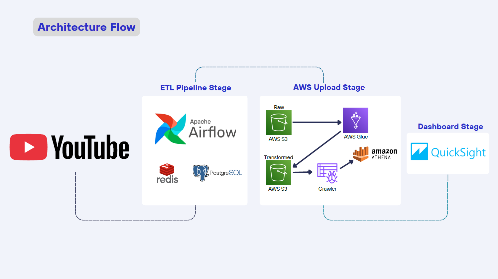

# Final Project Data Engineering Bootcamp
# Youtube Trending Video Analytics & Sentiment Pipeline

## 📌 Project Overview
Project ini bertujuan untuk membangun end-to-end data engineering pipeline yang memproses dan menganalisis YouTube Trending Videos beserta sentimen audiens berdasarkan berbagai subject profesional seperti Data Engineer, DevOps, Finance & Accounting, UI/UX, dan lainnya.

Pipeline ini menggunakan daily batch ingestion dari YouTube Data API untuk setiap subject query. Data yang diambil mencakup metadata video serta komentar teratas, kemudian dilakukan sentiment analysis dengan menghitung average sentiment score dari komentar tersebut.

Hasil akhir data disimpan dalam format Parquet dan divisualisasikan melalui AWS QuickSight dashboard untuk analisis engagement dan sentimen.

## 📌 Flow Pipeline:
Youtube Data API -> Python ETL -> Airflow Orchestration -> Amazon S3 Raw Data Upload -> AWS Glue ETL -> AWS Glue Data Catalog -> Quick Sight Dashboard



## 📌 Key Features
- Daily batch ingestion menggunakan Apache Airflow
- Sentiment analysis berbasis komentar teratas video
- Multi-topic analysis berdasarkan subject profesional
- Schema enforcement menggunakan AWS Glue
- Interactive dashboard untuk analisis engagement & sentiment

## 📌 System Requirements
- Visual Studio
- Python
- Docker 
- Apache Airflow 
- PostgreSQL

## 📌 Required Credentials & Configuration
Input unik yang harus diinput didalam file config.conf untuk menjalankan pipeline ini yaitu:
- Youtube API Key (Dari google cloud console API credentials)
- AWS Credentials (Key, Secret Key, Region, Bucket Name)

## 📌 How To Setup

1. Pastikan semua file sudah di clone di satu folder
2. Pastikan config.conf variable sudah di isi (Youtube API Key dan AWS Credentials)
3. Build image dengan

```bash
docker compose up -d --build
```

3. Setelah selesai, akses airflow webserver UI di

```bash
http://localhost:8080
```

## 📌 Dashboard Example
Dashboard ini digunakan untuk menganalisis performa YouTube video berdasarkan
subject profesional, dengan fokus pada engagement dan sentiment analysis.


## Author
**Luthfi Arif Radriyantomo**


